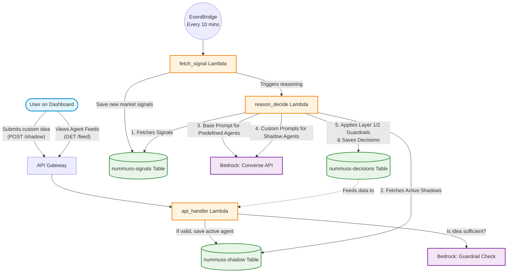

# Nummuss Architecture & System Flow

Nummuss is an event-driven serverless application built on AWS, designed to enforce deterministic behavioral safety guardrails on AI-generated trading decisions.

## 1. Core Concept & Agents

Nummuss explores behavioral guardrails in AI trading by running distinct agents simultaneously on the same market signals:

1. **Disciplined Agent**
   - Follows all strict safety rules (Layer 1 Evidence, Layer 2 Behavioral Guardrails like daily loss caps, position limits, cooldowns).
   - Serves as the "safe" benchmark.
   
2. **Undisciplined Twin**
   - Receives the exact same signals and uses the exact same model, but intentionally bypasses Layer 2 behavioral guardrails.
   - Purpose: To provide a counterfactual (A/B test) demonstrating what happens when risky behaviors (revenge trading, FOMO) are allowed.

3. **Shadow Agent (Custom User Agent)**
   - A fully customizable 3rd trading agent instantiated by the user via the `/shadow` API.
   - Users provide a custom trading behavior prompt (e.g., "always buy when RSI < 30", "double my size if I lose"). 
   - A Bedrock guardrail checks if the prompt is *sufficient* (i.e. contains clear instructions for an agent) without judging if the strategy is profitable. 
   - If valid, this Shadow Agent runs a bounded **paper** portfolio for a chosen duration (1 to 30 days). It never sends a brokerage order. A user is limited to 1 active shadow agent at a time.
   - The user can track its performance in real-time against the predefined agents.

## 2. System Flow

1. **Ingestion**: EventBridge triggers the `fetch_signal` Lambda every 10 minutes. It fetches market data and stores it in DynamoDB (`nummuss-signals`).
2. **Reasoning Engine**: `fetch_signal` directly invokes `reason_decide`.
3. **Multi-Agent Evaluation**: 
   - `reason_decide` queries DynamoDB via a Global Secondary Index for all active Shadow Agents.
   - It performs a base LLM inference via Amazon Bedrock for the predefined agents.
   - It iterates through all active Shadow Agents, performing a *custom* LLM inference for each by injecting their unique `behavior_prompt`.
   - All agents' decisions are pushed through Layer 1 & 2 guardrails.
   - Decisions are saved to `nummuss-decisions` in DynamoDB.
4. **Data Retrieval**: The React frontend retrieves the owned agent and its comparison ledger through `GET /shadow/active` and `GET /shadow/{agent_id}/performance`.

## 3. The Shadow Function Detail

Previously a simple testing endpoint, the Shadow Function is now a fully automated lifecycle:
- **Initialization (`POST /shadow`)**: Accepts a `user_id`, a custom `idea`, and a `duration_days` (1-30). 
- **LLM Guardrail**: The `api_handler` calls Bedrock to check *sufficiency*. It asks: "Does this text contain actionable trading instructions?" It explicitly ignores whether the instructions are rational (e.g., allowing a user to test "go all in on a loss").
- **Persistence**: The agent and a user-specific expiry lock are created atomically in the `nummuss-shadow` DynamoDB table. This makes the one-active-agent limit race-safe.
- **Execution**: Automatically picked up by the `reason_decide` cron job until the `end_time` expires. Decisions update a 5%-maximum-allocation paper portfolio stored beside the agent, plus matching portfolios for the two predefined agents.

## 4. Shared Library (`lambdas/common`)
- Deployed as a Lambda Layer (`CommonLayer`) mapped to `/opt` in the Lambda execution environment.
- Contains Pydantic/dataclass data schemas, Layer 1/2 logic, and deterministic test fixtures.

## 5. Deployment Details & Minor Gotchas

1. **Bedrock permissions**:
   - Lambda uses its IAM execution role for Bedrock; do not place a long-lived Bedrock token in an environment variable.
   - Ensure the chosen model is enabled in the deployment region. The development default is Claude 3 Haiku to keep experimentation costs bounded.
2. **DynamoDB Global Secondary Index (GSI)**:
   - The `nummuss-shadow` table relies heavily on a GSI called `StatusIndex` on the `status` attribute. If deploying to an existing stack, CDK will handle index creation automatically, but be aware of index creation times on large tables.
3. **Lambda Timeout & Memory**:
   - Because `reason_decide` now potentially makes *multiple* synchronous LLM calls (1 base + N shadow agents), the Lambda timeout is set to 60 seconds. 
   - **Scale Warning**: If thousands of shadow agents are active simultaneously, the lambda will hit the 60-second limit. At scale, you will need to decouple the shadow agent execution (e.g., using SQS queues to trigger parallel Lambdas for each agent).
4. **Frontend Asset Deployment**:
   - You **must** run `npm run build` in the `frontend` directory *before* deploying the backend with CDK. The CDK stack (`s3deploy.BucketDeployment`) relies on the `frontend/dist` directory existing to upload it to the S3 static hosting bucket.
5. **Vite API Routing**:
   - In production, CloudFront proxies API requests from `/api/*` to the API Gateway using a CloudFront Function (`ApiPathRewrite`) to strip the `/api` prefix. Local development uses Vite's `server.proxy` to accomplish the same thing.
