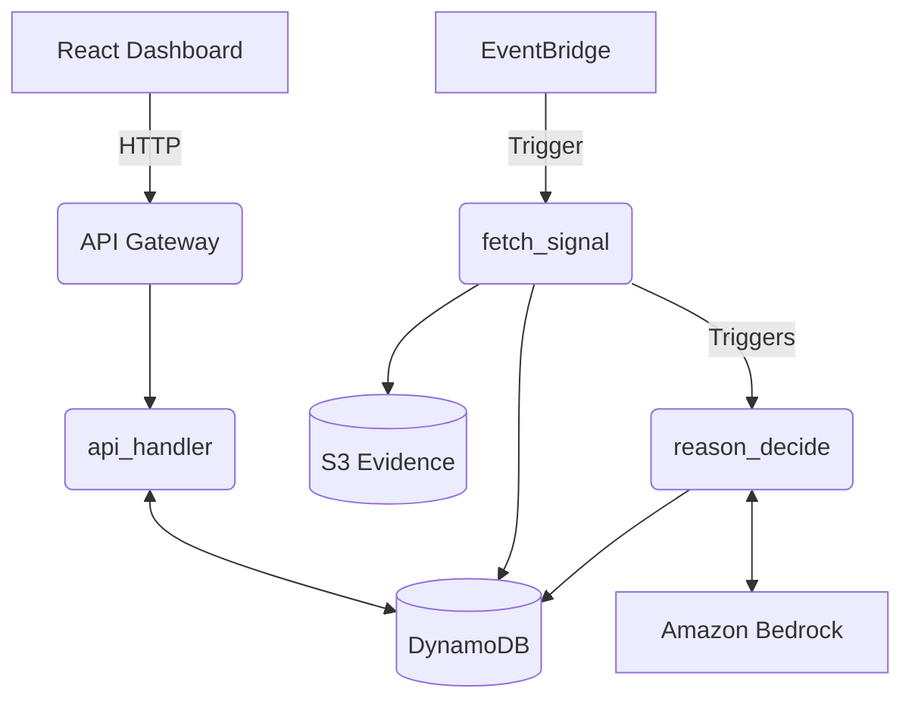

# Architecture

Nummuss is an event-driven serverless application built on AWS, designed to enforce deterministic behavioral safety guardrails on AI-generated trading decisions.

## System Components

### 1. The React Dashboard (`frontend/`)
- A static React single-page application built with Vite and TailwindCSS.
- Framer Motion and GSAP handle complex animations and Lenis for smooth scrolling.
- Hosted statically (can be deployed to S3/CloudFront).
- Interacts with the backend entirely through API Gateway REST calls.

### 2. Event-Driven AI Pipeline (`backend/`)

#### A. Fetch Signal (`lambdas/fetch_signal`)
- **Trigger**: Amazon EventBridge chron (e.g., every 10 minutes).
- **Function**: Polls market data, news sources, or uses seeded deterministic fixtures for the demonstration.
- **Storage**: Appends structured signals to `nummuss-signals` DynamoDB table and raw artifacts to S3.

#### B. Reason & Decide (`lambdas/reason_decide`)
- **Trigger**: Currently manual or downstream of `fetch_signal`.
- **Reasoning**: Queries Amazon Bedrock (Claude 3 Haiku) to generate a trade decision based on recent signals.
- **Safety Enforcement**:
  - **Layer 0**: Bedrock Guardrails scan for malicious prompts or banned content.
  - **Layer 1**: Deterministic validation. Extracted symbols and claims must map directly to the `nummuss-signals` ledger.
  - **Layer 2**: Behavioral rules (e.g., maximum daily loss, position sizing caps, cooldown after consecutive losses). 
- **The Twin Experiment**: Generates decisions for *both* a 'disciplined' agent (bound by Layer 2) and an 'undisciplined' twin (Layer 2 bypassed) to measure counterfactual performance.
- **Storage**: Saves decisions to the `nummuss-decisions` DynamoDB table.

#### C. API Handler (`lambdas/api_handler`)
- **Trigger**: API Gateway HTTP requests from the frontend.
- **Endpoints**:
  - `GET /feed`: Returns the stream of decisions for the dashboard.
  - `GET /decision/{id}`: Detailed view of a single decision and its guardrail trace.
  - `GET /counterfactual`: Aggregated metrics comparing the disciplined agent to the twin.
  - `POST /shadow`: A live "challenge" endpoint that evaluates user-submitted trade ideas against Layer 1 and 2 rules deterministically without an LLM call.

### 3. Shared Library (`lambdas/common`)
- Deployed as a Lambda Layer (`CommonLayer`) mapped to `/opt` in the Lambda execution environment.
- Contains Pydantic data schemas, Layer 1/2 logic, and deterministic test fixtures.

## Infrastructure as Code
The entire backend stack is defined in AWS CDK (`backend/infrastructure/nummuss_stack.py`). It provisions the DynamoDB tables, S3 bucket, Lambda functions, IAM roles, EventBridge rules, and API Gateway.

## Data Flow Diagram

