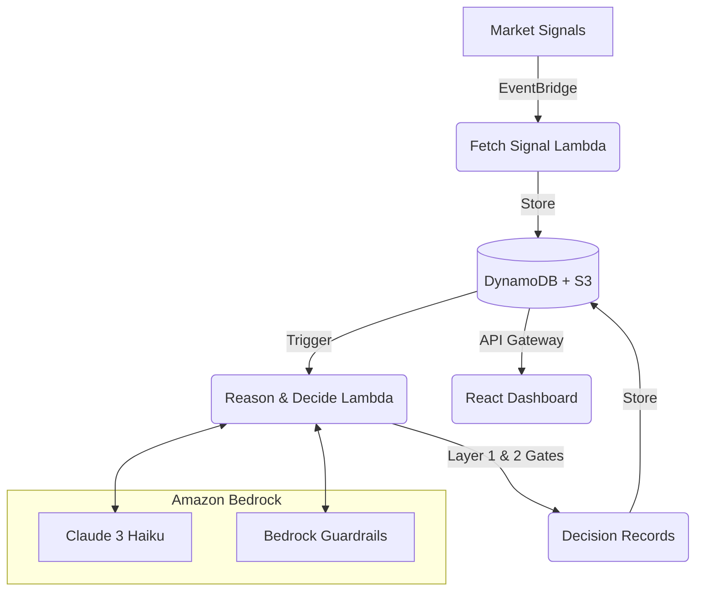

# Nummuss

**The behavioral safety layer for AI trading agents.**

India does not have an information shortage in retail trading — it has a discipline and risk-control problem. Nummuss sits between an AI agent and its execution path, at the exact decision point where risky behavior becomes an executable action: position size, repeated losses, stale evidence, overtrading, impulsive re-entry.

> **Note**: Simulation only. No real capital. Not investment advice.

---

## The Experiment: Twin Agents

Nummuss demonstrates its value by running a controlled counterfactual experiment. 
Every 10 minutes, one signal stream feeds two configuration-forked agents:

1. **The Disciplined Agent**: Bound by a 3-layer deterministic safety gate.
2. **The Undisciplined Twin**: Exposed to documented failure modes (revenge trading, tip chasing, overconfidence, averaging down).

By tracking both agents under the same market context, Nummuss measures the **counterfactual difference** — exactly what capital is saved by enforcing discipline.

## Architecture & The Three Gates

The platform evaluates every LLM-generated decision against three safety gates before it can be executed:

1. **Layer 0 (AWS Managed)**: Bedrock Guardrails scan for prompt-attacks, sensitive information, and denied topics. Untrusted market text is treated as hostile input.
2. **Layer 1 (Evidence Consistency)**: Deterministic application logic checks that every claim, ticker, and price cited by the agent maps directly to a stored, verified signal. Stale or single-source evidence forces a `HOLD`.
3. **Layer 2 (Behavioral Guardrails)**: Deterministic trading discipline rules (position caps, daily loss limits, cooldown periods). This is the variable layer bypassed by the Undisciplined Twin.

## AWS Services

Nummuss is built natively on AWS using Serverless architecture:
- **Amazon Bedrock**: LLM reasoning engine (Claude 3 Haiku) and Layer 0 Guardrails.
- **AWS Lambda**: Event-driven Python execution for signal fetching, reasoning, and API routing.
- **Amazon DynamoDB**: High-performance audit ledger for signals and decision records.
- **Amazon S3**: Immutable blob storage for evidence snapshots.
- **Amazon EventBridge**: 10-minute cron orchestration.
- **Amazon API Gateway**: Secure, rate-limited REST API for the frontend dashboard.
- **AWS CDK**: Infrastructure as Code (Python) for repeatable deployment.

## Running Locally

### Backend (CDK)
1. Navigate to `backend/`
2. Create and activate a virtual environment: `python3 -m venv .venv && source .venv/bin/activate`
3. Install dependencies: `pip install -r requirements.txt`
4. Synthesize stack: `cdk synth`
5. Deploy: `cdk deploy`

### Frontend (React + Vite)
1. Navigate to `frontend/`
2. Install dependencies: `npm install`
3. Configure environment variables in `.env`
4. Run dev server: `npm run dev`

## Features

- **India Replay Mode**: Scrub through historical NIFTY 50 scenarios and watch the twin agents diverge.
- **Shadow Mode**: Challenge the agent via the `/shadow` API. Submit a trade idea and receive a deterministic verdict from the Layer 1 and 2 gates — without an LLM call.
- **Full Auditability**: Every decision, blocked or executed, includes a citations array mapping to S3 evidence and the exact guardrail that evaluated it.

---
*Built for the Bharat Builds Tour 2026.*
